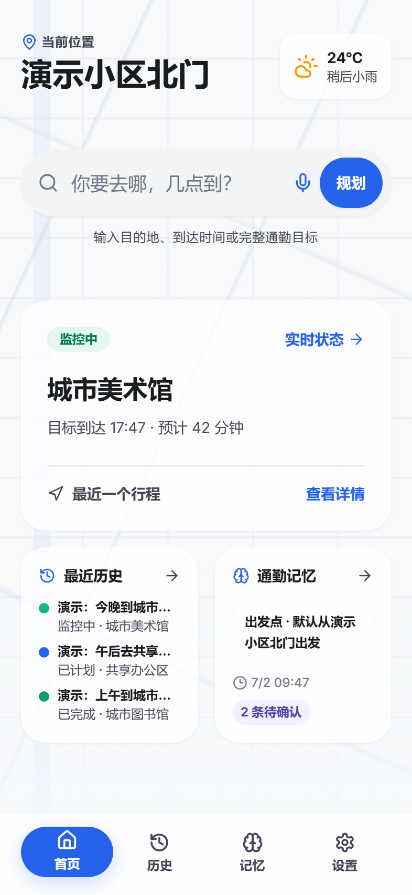
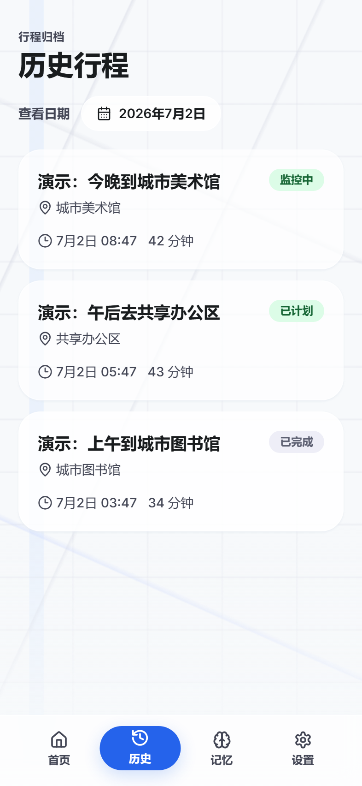
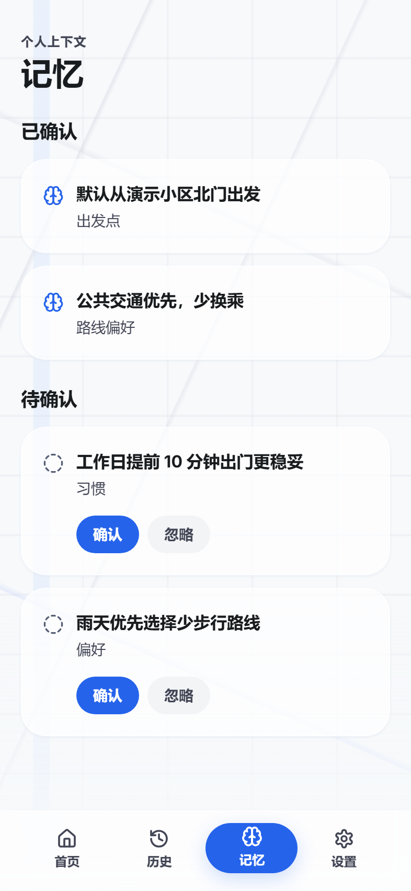
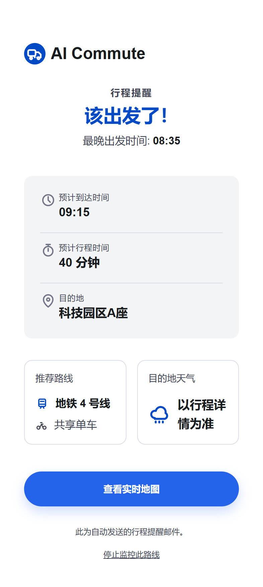
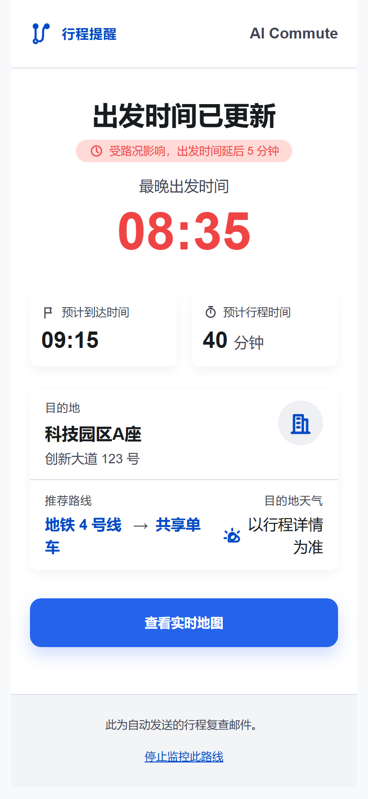

# AI Commute

<p align="center">
  
</p>

<p align="center"><strong>Your AI Commute Planning & Reminder Assistant</strong></p>

<p align="center">
  <a href="#功能亮点">Feature Highlights</a>
  ·
  <a href="README.en.md">English</a>
  ·
  <a href="#docker">Docker Deployment</a>
  ·
  <a href="#本地开发">Local Development</a>
</p>

<p align="center">
  
  
  
  
  
</p>


## Project Overview

AI Commute is an intelligent planning application designed for personal commuting scenarios. It leverages Next.js, Prisma/SQLite, Amap (Gaode Maps) capabilities, and an OpenAI-compatible planning runner to create a complete commuting workflow that ties together place search, route options, weather references, trip reminders, Telegram conversations, and email notifications.

It is ideal for scenarios such as:

- Calculating the departure time needed to arrive at a specific time each day.
- Wanting AI to generate commute plans based on preferences, routes, and weather conditions.
- Continuing conversations with the AI agent or switching trips via Telegram.
- Receiving arrival reminders and route change alerts via email/Telegram.

## Feature Highlights

- **AI Route Planning**: Creates agent sessions from natural language goals, invoking tools for places, routes, weather, and persistence to generate trip itineraries.
- **Multi-leg Trips & Buffers**: Supports route segmentation, weather/traffic buffers, latest departure times, and reminder schedules.
- **Trip Sharing**: Generates public, revocable read-only links and creates PNG share images with QR codes (aspect ratio up to 9:16).
- **User-level Settings**: Saves default city, default departure point, commute preferences, Telegram Chat ID, email recipients, and route change thresholds.
- **Notification Loop**: Includes a built-in scheduler, Telegram worker, email templates, and notification sending logs.
- **Deployment Friendly**: Supports one-click local startup and Docker Compose for simultaneously running Web, scheduler, and Telegram worker.

## Screenshots

| Home | History | Memories |
| --- | --- | --- |
|  |  |  |

### Email Reminders

<p align="center">
  
  
</p>

## Tech Stack

- Next.js 15 / React 19 / TypeScript
- Prisma / SQLite
- Tailwind CSS / lucide-react
- Vitest / Playwright
- Nodemailer / Telegram Bot API
- OpenAI-compatible Chat Completions

## Local Development

1. Copy and fill in the environment variables:

```bash
cp .env.example .env
```

2. Install dependencies:

```bash
npm install
```

3. Prepare the database:

```bash
npm run prisma:deploy
npm run prisma:seed
```

4. Start the development server:

```bash
npm run dev
```

Default seed account:

```text
user@example.com / password
```

## Common Scripts

```bash
npm run dev
npm run build
npm run start
npm run lint
npm test
npm run test:watch
npm run prisma:generate
npm run prisma:migrate
npm run prisma:deploy
npm run prisma:seed
npm run scheduler:tick
npm run email:test-templates
npm run email:test-departure-reminder
npm run email:test-route-change
npm run telegram:poll
```

## Docker

To run Web, scheduler, and Telegram worker simultaneously:

```bash
docker compose up --build
```

The `migrate` one-off service runs `npx prisma migrate deploy && npm run prisma:seed` first. The `web`, `scheduler`, and `telegram` services depend on it via `service_completed_successfully`, ensuring the SQLite schema and seed account are ready before the long-running services start.

- `web`: Runs `npm run start`, exposes `3000:3000`.
- `scheduler`: Executes `npm run scheduler:tick` every 60 seconds.
- `telegram`: Runs `npm run telegram:poll` if `TELEGRAM_BOT_TOKEN` is configured; otherwise, keeps the container idle to prevent repeated restarts due to `unless-stopped`.
- SQLite data is persisted to the host `./data`, with the container path set to `/app/data`.

The `web`, `scheduler`, and `telegram` services use `restart: unless-stopped` for automatic recovery after server reboots or abnormal exits; `migrate` remains a one-off service with `restart: "no"`.

## One-Click Local Deployment

Windows:

```powershell
.\start-all.ps1
```

You can also double-click `start-all.cmd`. If PowerShell execution policies block the script, use `start-all.cmd`, which invokes the PowerShell entry with `ExecutionPolicy Bypass`.

Linux:

```bash
chmod +x ./start-all.sh
./start-all.sh
```

Available parameters:

```bash
npm run start:all -- --configure
npm run start:all -- --yes
```

## Telegram Bi-directional Interface

The Telegram polling worker requires configuration in `.env`:

```bash
TELEGRAM_BOT_TOKEN=
```

After logging into the website, users must save their Telegram Chat ID on the settings page so the worker can link Telegram conversations to site users.

Common commands:

- `/new 明天九点到外事学校` creates a new trip.
- Send any plain text after `/new` to create a new trip.
- Plain text messages continue the current agent conversation.
- `/trips` switches the trip bound to the current Telegram conversation via inline buttons.
- `/cancel` cancels monitoring of the current trip.

## Email Reminders

Once SMTP is fully configured, the scheduler can send departure and route change reminders. Recipients are entered by users on the settings page and are not stored in `.env`.

```bash
SMTP_HOST=
SMTP_PORT=587
SMTP_SECURE=false
SMTP_USER=
SMTP_PASS=
SMTP_FROM=
SMTP_TLS_USE_SYSTEM_CA=false
```

Locally test mock email templates:

```bash
npm run email:test-templates
npm run email:test-departure-reminder
npm run email:test-route-change
```

## Environment Variables

Core configurations:

- `DATABASE_URL`: Prisma database connection, defaults to SQLite.
- `DEFAULT_CITY`: Default city.
- `DEFAULT_TIMEZONE`: Default timezone, e.g., `Asia/Shanghai`.
- `AMAP_API_KEY`: Amap Web Service Key; leave empty to use the mock AMap client.
- `OPENAI_API_KEY`: Credentials for the OpenAI-compatible planning runner; leave empty to use the built-in fallback planner.
- `OPENAI_BASE_URL`: Custom base URL for the OpenAI-compatible API.
- `OPENAI_MODEL`: Model name for the planning runner.
- `APP_BASE_URL`: Public root URL of the site, e.g., `https://commute.example.com`; used for share QR codes and notification links. Explicitly configure this in production to prevent internal localhost URLs from appearing in shared content behind a reverse proxy.
- `SEED_USER_EMAIL`: Seed account email.
- `SEED_USER_PASSWORD`: Seed account password.
- `SCHEDULER_TICK_SECRET`: Shared secret to protect the scheduler tick API. A sufficiently long random string is recommended for production. If empty in production, the Web process will auto-generate a temporary in-memory key to prevent the public tick API from being exposed. Configure a fixed key if external manual tick API calls are needed.
- `TELEGRAM_BOT_TOKEN`: Telegram bot token.

> Amap API URL: https://console.amap.com/dev/index. Offers a free monthly quota, which is more than enough for personal use. This project limits concurrency to 3.

## Testing

Unit and integration tests:

```bash
npm test
```

Type checking:

```bash
npm run lint
```

Production build:

```bash
npm run build
```

Playwright E2E:

```bash
npm run test:e2e -- tests/e2e/commute-flow.spec.ts --reporter=line --workers=1
npm run test:e2e -- tests/e2e/trip-sharing.spec.ts --reporter=line --workers=1
```

---

## Acknowledgments

- CodeX
- GPT-Image-2
- stitch
- Linux Do
- 啃果干儿^-^
